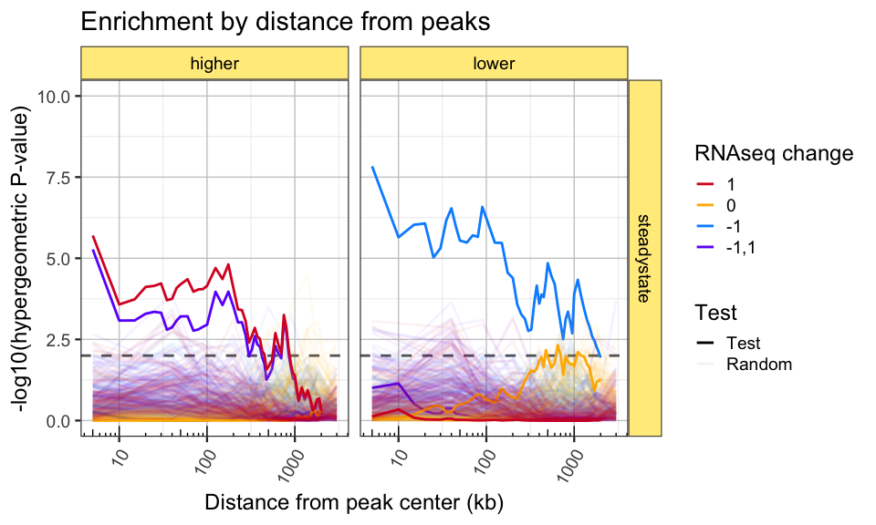
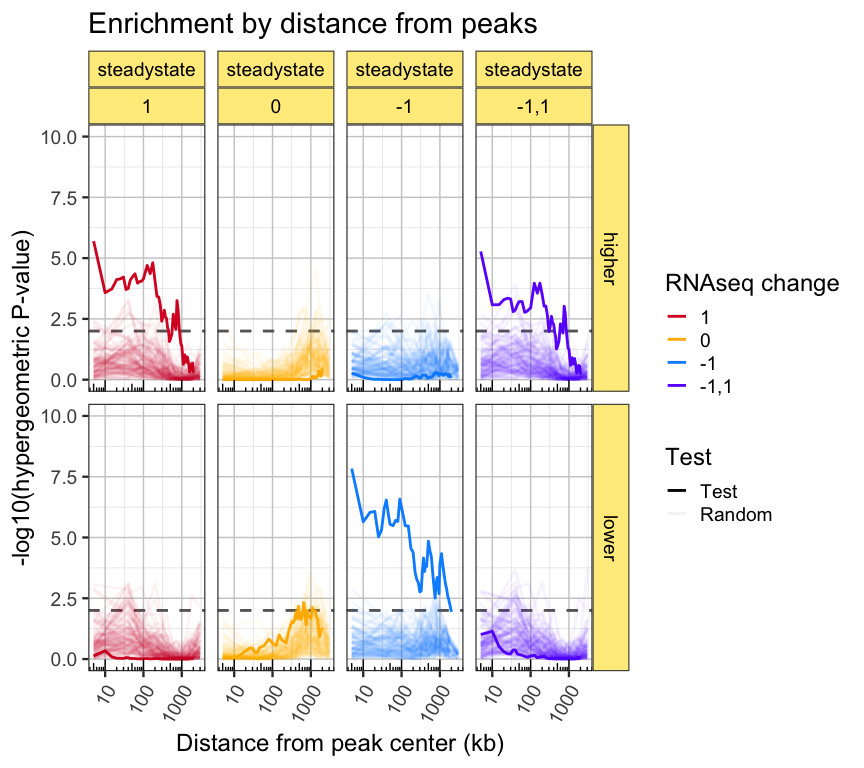

<!-- README.md is generated from README.Rmd. Please edit that file -->

# peakdistanceenrichment

ATACseq peak enrichment using sliding scale distance.

The goal of the R package `peakdistanceenrichment` is to provide
convenient way to reproduce the enrichment method used by Langer et al
2019, eLife.

## Installation

``` r
remotes::install_github("jmw86069/peakdistanceenrichment")
```

## Package Reference

A full online function reference is available via the pkgdown
documentation:

[Full command
reference](https://jmw86069.github.io/peakdistanceenrichment)

## The workflow

In short:

  - A set of “features” are provided, where each feature has a
    “category”.
    
      - In this case, the features are RNAseq genes, and the category
        values are `-1` for down-regulated genes, `1` for up-regulated
        genes, and `0` for genes not changed.

  - One or more sets of “peaks” are provided.
    
      - In this case, there are two sets of peaks:
      - **higher accessibility** ATACseq peaks
      - **lower accessibility** ATACseq peaks

  - A range of distances is provided, by default `0` to `5000` in
    kilobases, so the largest range is 5,000,000 bases.

  - For each set of peaks, each category is tested for enrichment
    against the other categories.
    
      - For example features with category `-1` are tested to see if
        they overlap **lower accessibility** peaks more than you would
        randomly expect compared to features with category `0, 1`.
      - The features are extended across the range of distances, and
        this test is repeated for each distance.

## Example analysis

The package contains sample files sufficient to reproduce Figure 2B of
the Langer et al 2019 eLife paper.

The steps below import the example files and create the required
`GRanges` objects.

``` r
library(peakdistanceenrichment)
library(GenomicRanges)

# import hg19 chromosome sizes
hg19file <- system.file("extdata",
   "hg19.sizes.txt",
   package="peakdistanceenrichment");
hg19df <- data.table::fread(hg19file, data.table=FALSE);
hg19seqinfo <- Seqinfo(seqnames=hg19df[,1],
   seqlengths=hg19df[,2],
   isCircular=hg19df[,3],
   genome=hg19df[,4])

## Import features, TSS sites
tssfile <- system.file("extdata",
   "BAF47KD_steadystate_RNAseq_hits.bed",
   package="peakdistanceenrichment");
tssdf <- data.table::fread(tssfile, data.table=FALSE)
colnames(tssdf) <- c("seqnames", "start", "end", "gene", "hit")
tssgr <- as(tssdf, "GRanges")
## assign seqinfo
seqinfo(tssgr) <- hg19seqinfo;

## Create tss list
tssL <- list();
tssL$steadystate <- tssgr;


## Load peak files
higherbed <- system.file("extdata",
   "BAF47KD_steadystate_higher_accessibility_peaks.bed",
   package="peakdistanceenrichment");
higherdf <- data.table::fread(higherbed, data.table=FALSE)
colnames(higherdf)[1:3] <- c("seqnames", "start", "end");
highergr <- as(higherdf, "GRanges")
seqinfo(highergr) <- hg19seqinfo;

lowerbed <- system.file("extdata",
   "BAF47KD_steadystate_lower_accessibility_peaks.bed",
   package="peakdistanceenrichment");
lowerdf <- data.table::fread(lowerbed, data.table=FALSE)
colnames(lowerdf)[1:3] <- c("seqnames", "start", "end");
lowergr <- as(lowerdf, "GRanges")
seqinfo(lowergr) <- hg19seqinfo;

## Create peak list for each set of TSS sites
peaksL <- list();
peaksL$steadystate <- list(
   higher=highergr,
   lower=lowergr);
```

Next, the features and peaks are tabulated across the range of
distances, for each category.

``` r
## Call peak_feature_ranged_counter()
## - count features per peak
## - using an expanded peak size
range_counts <- peak_feature_ranged_counter(
   peaksL=peaksL,
   featuresL=tssL,
   expand_range_kb=c(5, 2000),
   verbose=TRUE,
   category_colname="hit");
#> ##  (16:55:56) 05Feb2021:  peak_feature_ranged_counter(): cat_levels:-1,0,1 
#> ##  (16:55:56) 05Feb2021:  peak_feature_enrich(): Processing Experiment:steadystate 
#> ##  (16:55:56) 05Feb2021:  peak_feature_enrich():       Processing PeakSet:higher, length(PeakSet):3121, length(featuresGR):17462 
#> ##  (16:55:59) 05Feb2021:  peak_feature_enrich():       Processing PeakSet:lower, length(PeakSet):4186, length(featuresGR):17462
```

The counts are tested with hypergeometric enrichment, to test each
category, for each set of peaks, and at each distance. The output is a
`data.frame` that include the hypergeometric P-value in column
`"phyper.p"`. It also includes the values passed to `phyper()`, specific
the `q, m, n, k` values.

``` r
paramsDF <- peak_feature_ranged_enrichment(range_counts,
   test_cats=list(c("1"), c("0"), c("-1")))
print(head(paramsDF))
#>      Experiment PeakSet Range q_drawn1 m_drawn1_undrawn1 n_drawn0_undrawn0
#> 1.1 steadystate  higher     5       60              1768             15694
#> 1.2 steadystate  higher    10       79              1768             15694
#> 1.3 steadystate  higher    15      104              1768             15694
#> 1.4 steadystate  higher    20      132              1768             15694
#> 1.5 steadystate  higher    25      157              1768             15694
#> 1.6 steadystate  higher    30      177              1768             15694
#>     k_drawn0_drawn1 test_cat phyper.p
#> 1.1             328        1 1.99e-06
#> 1.2             537        1 2.65e-04
#> 1.3             737        1 1.84e-04
#> 1.4             955        1 7.64e-05
#> 1.5            1167        1 7.10e-05
#> 1.6            1336        1 5.98e-05
```

This result can be plotted manually, or by using the helper function
`plot_ranged_enrichment()`.

``` r
## Plot the enrichment P-values
gg_pre <- plot_ranged_enrichment(paramsDF,
   test_cat_title="RNAseq\ndirection",
   draw_points=FALSE) +
   scale_x_log10() +
   annotation_logticks(sides="b")
print(gg_pre)
```

<!-- -->

If you want to update the category labels, you can do something like
this:

``` r
## You can be fancy and assign labels
paramsDF$test_cat <- factor(
   ifelse(paramsDF$test_cat %in% "1",
      "up-regulated",
      ifelse(paramsDF$test_cat %in% "-1",
         "down-regulated",
         "unchanged")),
   levels=c("up-regulated",
      "unchanged",
      "down-regulated"));
gg_pre2 <- plot_ranged_enrichment(paramsDF,
   test_cat_title="RNAseq\ndirection",
   draw_points=FALSE) +
   scale_x_log10()
gg_pre2
```

<!-- -->

If you’re curious, you can view the intermediate counts by using the
helper function `plot_ranged_counts()`. One key feature of this plot is
the distance at which the “non-overlapping” profiles recede down to
zero. Eventually, at some infinite distance, every feature should
overlap every peak, therefore the non-overlapping features should become
zero.

``` r
gg_prc <- plot_ranged_counts(range_counts) +
   facet_grid(Subclass~Experiment+PeakSet)
gg_prc
```

<!-- -->

## Random permutations

After receiving a very helpful reviewer request, we implemented analysis
steps to test enrichment of random ATACseq peaks, to ensure that our
observed enrichment tests were substantially different than what one
would observe from using any random locations in the genome.

The strategy was to take the full set of ATACseq peaks that were tested
for differential changes, and randomize the results of that test. This
approach was preferred instead of generating fully random locations in
the hg19 human genome, because ATACseq peaks are known to have a bias
toward active gene promoter regions, and other particular areas of
genome function. We wanted to test enrichment using random peaks that
have the same bias that one would expect from a set of ATACseq peaks in
the cell type being studied.

An alternative approach that we did not implement, might be to randomize
the RNAseq “category values” across the RNAseq features. Ultimately the
two approaches should address the same question, and in largely similar
ways, yielding the same result.

First, import the full set of ATACseq peaks tested, which includes
163,782 regions in the genome.

``` r
# BAF47KD_steadystate_tested_peaks.bed
randombed <- system.file("extdata",
   "BAF47KD_steadystate_tested_peaks.bed",
   package="peakdistanceenrichment");
randomdf <- data.table::fread(randombed, data.table=FALSE)
colnames(randomdf)[1:3] <- c("seqnames", "start", "end");
randomgr <- as(randomdf, "GRanges")
seqinfo(randomgr) <- hg19seqinfo;
randomsL <- list()
randomsL$steadystate <- randomgr;
```

Next, call `peak_feature_ranged_counter()` 100 times and add the
argument `randomsL` which supplies the set of peaks from which random
peaks will be chosen. This way, the number of random peaks will be equal
to the number of test peaks.

Note for this scenario, `expand_kb` is defined to have fewer random
distances, to decrease the time required.

``` r
## generate 100 different random subsets of ATAC peaks
expand_kb <- get_expanded_ranges(20, c(5, 3000));
n_iter <- 100;
random_counts_list <- lapply(seq_len(n_iter), function(n){
   if ((n / 10) %% 1 == 0 || n == 1) {
      jamba::printDebug("Iteration:", n);
   }
   random_range_counts <- peak_feature_ranged_counter(peaksL=peaksL,
      featuresL=tssL,
      randomsL=randomsL,
      do_random=TRUE,
      expand_kb=expand_kb,
      verbose=FALSE,
      category_colname="hit");
   #plot_ranged_counts(random_range_counts, dir_colors);
   random_range_counts;
});
#> ##  (16:56:03) 05Feb2021:  Iteration:1 
#> ##  (16:56:11) 05Feb2021:  Iteration:10 
#> ##  (16:56:20) 05Feb2021:  Iteration:20 
#> ##  (16:56:29) 05Feb2021:  Iteration:30 
#> ##  (16:56:38) 05Feb2021:  Iteration:40 
#> ##  (16:56:47) 05Feb2021:  Iteration:50 
#> ##  (16:56:56) 05Feb2021:  Iteration:60 
#> ##  (16:57:05) 05Feb2021:  Iteration:70 
#> ##  (16:57:14) 05Feb2021:  Iteration:80 
#> ##  (16:57:23) 05Feb2021:  Iteration:90 
#> ##  (16:57:32) 05Feb2021:  Iteration:100
```

Next we combine the random count results with the previous test results.
Note that each iteration must be numbered in order for the line plots to
be properly connected.

``` r
## combine with real test data already calculated
all_range_counts <- rbind(range_counts,
   jamba::rbindList(random_counts_list));
## Assign iteration numbers so lines can be drawn appropriately
all_range_counts$Iteration <- rep(seq(from=0, to=n_iter),
   c(nrow(range_counts),
      jamba::sdim(random_counts_list)[,1]));
## Define the "Test" from "Random" data
all_range_counts$Test <- rep(c("Test", "Random"),
   c(nrow(range_counts),
      sum(jamba::sdim(random_counts_list)[,1])));
```

Finally we perform hypergeometric tests, then plot the results using
alpha transparency for the random permutation results.

``` r
## Hypergeometric enrichment
all_paramsDF <- peak_feature_ranged_enrichment(all_range_counts,
   test_cats=list(c("1"), c("0"), c("-1"), c("-1","1")));

gg_all_enrich <- plot_ranged_enrichment(
   subset(all_paramsDF, q_drawn1 < m_drawn1_undrawn1),
   PeakSet_title="ATAC change",
   draw_points=FALSE,
   x_include=c(5, 2000),
   alpha_sub=c(`Test`=1, `Random`=0.05),
   test_cat_title="RNAseq change") +
   scale_x_log10() +
   annotation_logticks(sides="b")

print(gg_all_enrich)
```

<!-- -->

For this purpose, I prefer to look at each panel separately, as shown
below.

``` r
print(gg_all_enrich +
   facet_grid(PeakSet~Experiment+test_cat))
```

<!-- -->
