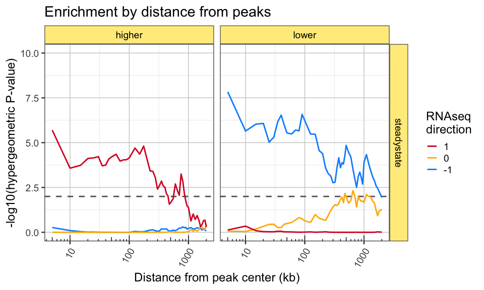
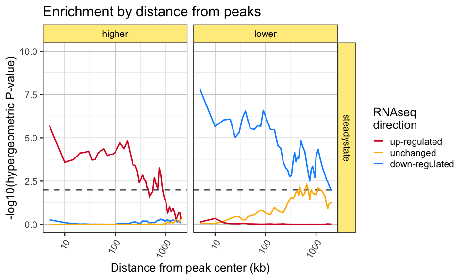
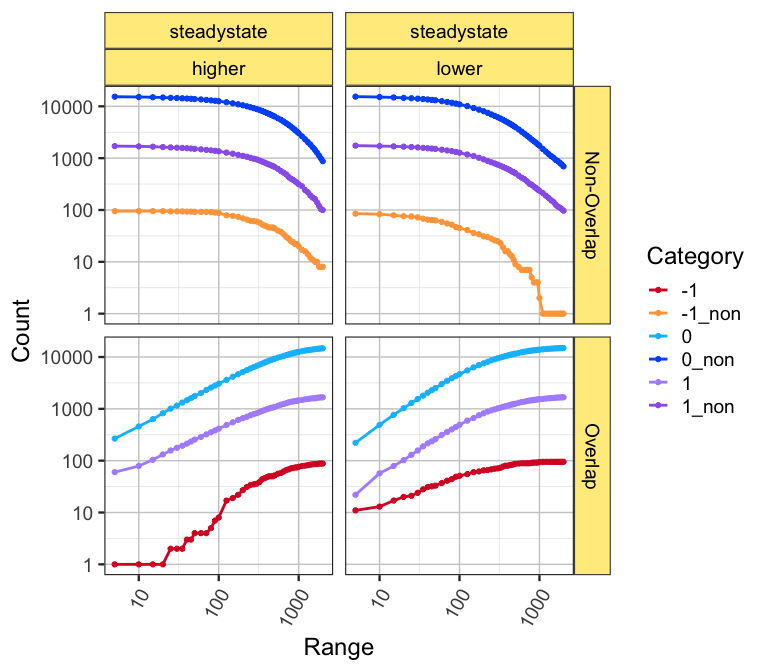

<!-- README.md is generated from README.Rmd. Please edit that file -->

# peakdistanceenrichment

ATACseq peak enrichment using sliding scale distance.

The goal of the R package `peakdistanceenrichment` is to provide
convenient way to reproduce the enrichment method used by Langer et al
2019, eLife.

## Installation

``` r
remotes::install_github("jmw86069/peakdistanceenrichment")
```

## Package Reference

A full online function reference is available via the pkgdown
documentation:

[Full command
reference](https://jmw86069.github.io/peakdistanceenrichment)

## The workflow

In short:

  - A set of “features” are provided, where each feature has a
    “category”.
    
      - In this case, the features are RNAseq genes, and the category
        values are `-1` for down-regulated genes, `1` for up-regulated
        genes, and `0` for genes not changed.

  - One or more sets of “peaks” are provided.
    
      - In this case, there are two sets of peaks:
      - **higher accessibility** ATACseq peaks
      - **lower accessibility** ATACseq peaks

  - A range of distances is provided, by default `0` to `5000` in
    kilobases, so the largest range is 5,000,000 bases.

  - For each set of peaks, each category is tested for enrichment
    against the other categories.
    
      - For example features with category `-1` are tested to see if
        they overlap **lower accessibility** peaks more than you would
        randomly expect compared to features with category `0, 1`.
      - The features are extended across the range of distances, and
        this test is repeated for each distance.

## Example analysis

The package contains sample files sufficient to reproduce Figure 2B of
the Langer et al 2019 eLife paper.

The steps below import the example files and create the required
`GRanges` objects.

``` r
library(peakdistanceenrichment)
library(GenomicRanges)

# import hg19 chromosome sizes
hg19file <- system.file("extdata",
   "hg19.sizes.txt",
   package="peakdistanceenrichment");
hg19df <- data.table::fread(hg19file, data.table=FALSE);
hg19seqinfo <- Seqinfo(seqnames=hg19df[,1],
   seqlengths=hg19df[,2],
   isCircular=hg19df[,3],
   genome=hg19df[,4])

## Import features, TSS sites
tssfile <- system.file("extdata",
   "BAF47KD_steadystate_RNAseq_hits.bed",
   package="peakdistanceenrichment");
tssdf <- data.table::fread(tssfile, data.table=FALSE)
colnames(tssdf) <- c("seqnames", "start", "end", "gene", "hit")
tssgr <- as(tssdf, "GRanges")
## assign seqinfo
seqinfo(tssgr) <- hg19seqinfo;

## Create tss list
tssL <- list();
tssL$steadystate <- tssgr;


## Load peak files
higherbed <- system.file("extdata",
   "BAF47KD_steadystate_higher_accessibility_peaks.bed",
   package="peakdistanceenrichment");
higherdf <- data.table::fread(higherbed, data.table=FALSE)
colnames(higherdf)[1:3] <- c("seqnames", "start", "end");
highergr <- as(higherdf, "GRanges")
seqinfo(highergr) <- hg19seqinfo;

lowerbed <- system.file("extdata",
   "BAF47KD_steadystate_lower_accessibility_peaks.bed",
   package="peakdistanceenrichment");
lowerdf <- data.table::fread(lowerbed, data.table=FALSE)
colnames(lowerdf)[1:3] <- c("seqnames", "start", "end");
lowergr <- as(lowerdf, "GRanges")
seqinfo(lowergr) <- hg19seqinfo;

## Create peak list for each set of TSS sites
peaksL <- list();
peaksL$steadystate <- list(
   higher=highergr,
   lower=lowergr);
```

Next, the features and peaks are tabulated across the range of
distances, for each category.

``` r
## Call peak_feature_ranged_counter()
## - count features per peak
## - using an expanded peak size
range_counts <- peak_feature_ranged_counter(
   peaksL=peaksL,
   featuresL=tssL,
   expand_range_kb=c(5, 2000),
   verbose=FALSE,
   category_colname="hit");
```

The counts are tested with hypergeometric enrichment, to test each
category, for each set of peaks, and at each distance. The output is a
`data.frame` that include the hypergeometric P-value in column
`"phyper.p"`. It also includes the values passed to `phyper()`, specific
the `q, m, n, k` values.

``` r
paramsDF <- peak_feature_ranged_enrichment(range_counts,
   test_cats=list(c("1"), c("0"), c("-1")))
print(head(paramsDF))
#>      Experiment PeakSet Range q_drawn1 m_drawn1_undrawn1 n_drawn0_undrawn0
#> 1.1 steadystate  higher     5       60              1768             15694
#> 1.2 steadystate  higher    10       79              1768             15694
#> 1.3 steadystate  higher    15      104              1768             15694
#> 1.4 steadystate  higher    20      132              1768             15694
#> 1.5 steadystate  higher    25      157              1768             15694
#> 1.6 steadystate  higher    30      177              1768             15694
#>     k_drawn0_drawn1 test_cat phyper.p
#> 1.1             328        1 1.99e-06
#> 1.2             537        1 2.65e-04
#> 1.3             737        1 1.84e-04
#> 1.4             955        1 7.64e-05
#> 1.5            1167        1 7.10e-05
#> 1.6            1336        1 5.98e-05
```

This result can be plotted manually, or by using the helper function
`plot_ranged_enrichment()`.

``` r
## Plot the enrichment P-values
gg_pre <- plot_ranged_enrichment(paramsDF,
   test_cat_title="RNAseq\ndirection",
   draw_points=FALSE) +
   scale_x_log10()
print(gg_pre)
```

<!-- -->

If you want to update the category labels, you can do something like
this:

``` r
## You can be fancy and assign labels
paramsDF$test_cat <- factor(
   ifelse(paramsDF$test_cat %in% "1",
      "up-regulated",
      ifelse(paramsDF$test_cat %in% "-1",
         "down-regulated",
         "unchanged")),
   levels=c("up-regulated",
      "unchanged",
      "down-regulated"));
gg_pre2 <- plot_ranged_enrichment(paramsDF,
   test_cat_title="RNAseq\ndirection",
   draw_points=FALSE) +
   scale_x_log10()
gg_pre2
```

<!-- -->

If you’re curious, you can view the intermediate counts by using the
helper function `plot_ranged_counts()`. One key feature of this plot is
the distance at which the “non-overlapping” profiles recede down to
zero. Eventually, at some infinite distance, every feature should
overlap every peak, therefore the non-overlapping features should become
zero.

``` r
gg_prc <- plot_ranged_counts(range_counts) +
   facet_grid(Subclass~Experiment+PeakSet)
gg_prc
```

<!-- -->
